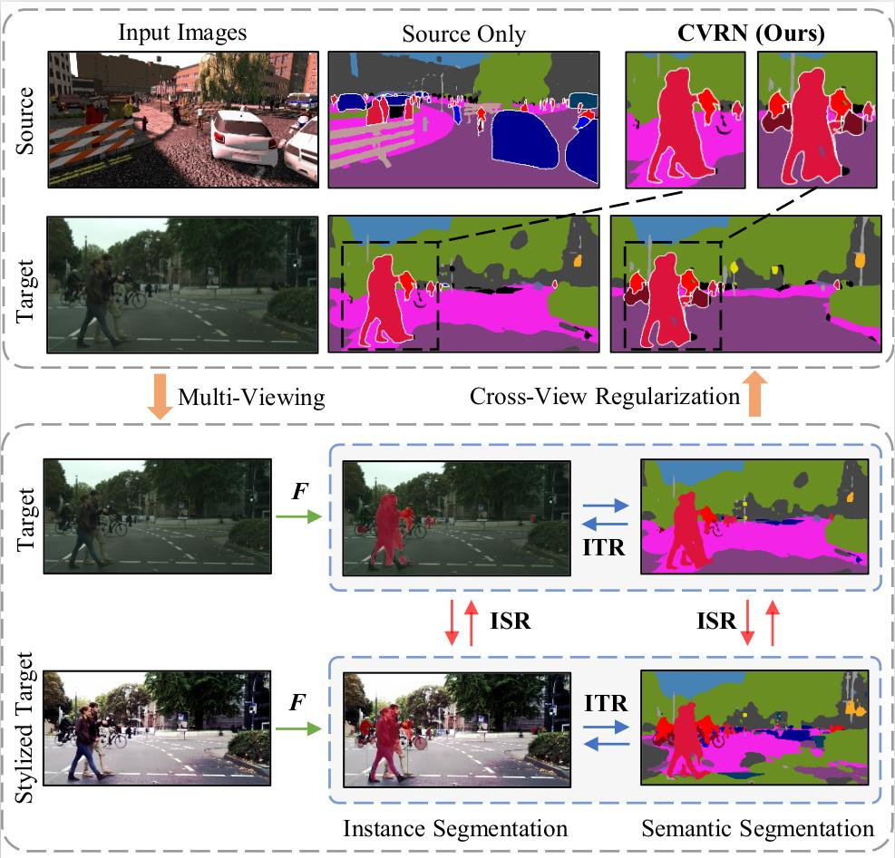

# Cross-View Regularization for Domain Adaptive Panoptic Segmentation

## Updates
- *08/2021*: check out our domain adaptation for video segmentation paper [Domain Adaptive Video Segmentation via Temporal Consistency Regularization](https://arxiv.org/abs/2107.11004) (accepted to ICCV 2021). This paper presents DA-VSN, a domain adaptive video segmentation network that addresses domain gaps in videos by temporal consistency regularization (TCR) for consecutive frames of target-domain videos. [Code avaliable](https://github.com/Dayan-Guan/DA-VSN).
- *06/2021*: check out our domain adapation for sematic segmentation paper [Scale variance minimization for unsupervised domain adaptation in image segmentation](https://www.researchgate.net/publication/347421562_Scale_variance_minimization_for_unsupervised_domain_adaptation_in_image_segmentation)(accepted to Pattern Recognition 2021). We design a scale variance minimization (SVMin) method by enforcing the intra-image semantic structure consistency in the target domain. [Code avaliable](https://github.com/Dayan-Guan/SVMin).
- *06/2021*: check out our domain adapation for object detection paper [Uncertainty-Aware Unsupervised Domain Adaptation in Object Detection](https://arxiv.org/abs/2103.00236) (accepted to IEEE TMM 2021). We design a uncertainty-aware domain adaptation network (UaDAN) that introduces conditional adversarial learning to align well-aligned and poorly-aligned samples separately in different manners. [Code avaliable](https://github.com/Dayan-Guan/UaDAN).

## Paper


[Cross-View Regularization for Domain Adaptive Panoptic Segmentation](https://arxiv.org/abs/2103.02584)  
 [Jiaxing Huang](https://scholar.google.com/citations?user=czirNcwAAAAJ&hl=en&oi=ao),  [Dayan Guan](https://scholar.google.com/citations?user=9jp9QAsAAAAJ&hl=en), [Xiao Aoran](https://scholar.google.com/citations?user=yGKsEpAAAAAJ&hl=en), [Shijian Lu](https://scholar.google.com/citations?user=uYmK-A0AAAAJ&hl=en)  
 School of Computer Science Engineering, Nanyang Technological University, Singapore  
 IEEE Conference on Computer Vision and Pattern Recognition (CVPR), 2021 (**Oral**)

If you find this code useful for your research, please cite our [paper](https://openaccess.thecvf.com/content/CVPR2021/papers/Huang_Cross-View_Regularization_for_Domain_Adaptive_Panoptic_Segmentation_CVPR_2021_paper.pdf):

```
@InProceedings{Huang_2021_CVPR,
    author    = {Huang, Jiaxing and Guan, Dayan and Xiao, Aoran and Lu, Shijian},
    title     = {Cross-View Regularization for Domain Adaptive Panoptic Segmentation},
    booktitle = {Proceedings of the IEEE/CVF Conference on Computer Vision and Pattern Recognition (CVPR)},
    month     = {June},
    year      = {2021},
    pages     = {10133-10144}
}
```

## Abstract
Panoptic segmentation unifies semantic segmentation and instance segmentation which has been attracting increasing attention in recent years. However, most existing research was conducted under a supervised learning setup whereas unsupervised domain adaptive panoptic segmentation which is critical in different tasks and applications is largely neglected. We design a domain adaptive panoptic segmentation network that exploits inter-style consistency and inter-task regularization for optimal domain adaptive panoptic segmentation. The inter-style consistency leverages semantic invariance across the same image of the different styles which fabricates certain self-supervisions to guide the network to learn domain-invariant features. The inter-task regularization exploits the complementary nature of instance segmentation and semantic segmentation and uses it as a constraint for better feature alignment across domains. Extensive experiments over multiple domain adaptive panoptic segmentation tasks (e.g. synthetic-to-real and real-to-real) show that our proposed network achieves superior segmentation performance as compared with the state-of-the-art.

## Preparation

### Pre-requisites
* Python 3.7
* Pytorch >= 0.4.1
* CUDA 9.0 or higher

### Install CVRN
0. Clone the repo:
```bash
$ git clone https://github.com/jxhuang0508/CVRN.git
$ cd CVRN
```
1. Creat conda environment:
```bash
$ conda env create -f environment.yaml
```

2. Clone UPSNet:
```bash
cd CVRN
$ git clone https://github.com/uber-research/UPSNet.git
```

3. Initialization:
```bash
$ cd UPSNet
$ sh init.sh
$ cp -r lib/dataset_devkit/panopticapi/panopticapi/ .
```

### Import Deeplab-v2
```bash
$ cd CVRN
$ git clone https://github.com/yzou2/CRST.git
```

### Prepare Dataset (Download Cityscapes dataset at UPSNet/data/cityscapes)
```bash
$ cd UPSNet
$ sh init_cityscapes.sh
$ cd ..
$ python cvrn/init_citiscapes_19cls_to_16cls.py
```

### Prepare CVRN
```bash
$ cp cvrn/models/* UPSNet/upsnet/models
$ cp cvrn/dataset/* UPSNet/upsnet/dataset
$ cp cvrn/upsnet/* UPSNet/upsnet
```

### Pre-trained models
Pre-trained models can be downloaded [here](https://github.com/jxhuang0508/CVRN/releases/tag/Latest) and put in ```CVRN/pretrained_models```

### Evaluation
```bash
$ cd UPSNet
$ python upsnet/test_cvrn_upsnet.py --cfg ../config/cvrn_upsnet.yaml --weight_path ../pretrained_models/cvrn_upsnet.pth
$ 2021-06-10 14:20:09,688 | base_dataset.py | line 499:           |    PQ     SQ     RQ     N
$ 2021-06-10 14:20:09,688 | base_dataset.py | line 500: --------------------------------------
$ 2021-06-10 14:20:09,688 | base_dataset.py | line 505: All       |  34.0   68.2   43.4    16
$ 2021-06-10 14:20:09,688 | base_dataset.py | line 505: Things    |  27.9   73.6   37.3     6
$ 2021-06-10 14:20:09,688 | base_dataset.py | line 505: Stuff     |  37.7   65.0   47.1    10
```
```bash
$ python upsnet/test_cvrn_pfpn.py --cfg ../config/cvrn_pfpn.yaml --weight_path ../pretrained_models/cvrn_pfpn.pth
$ 2021-06-10 14:27:36,841 | base_dataset.py | line 361:           |    PQ     SQ     RQ     N
$ 2021-06-10 14:27:36,842 | base_dataset.py | line 362: --------------------------------------
$ 2021-06-10 14:27:36,842 | base_dataset.py | line 367: All       |  31.4   66.4   40.0    16
$ 2021-06-10 14:27:36,842 | base_dataset.py | line 367: Things    |  20.7   68.1   28.2     6
$ 2021-06-10 14:27:36,842 | base_dataset.py | line 367: Stuff     |  37.9   65.4   47.0    10
```
```bash
$ python upsnet/test_cvrn_psn.py --cfg ../config/cvrn_psn.yaml --weight_path ../pretrained_models/cvrn_psn_maskrcnn_branch.pth
$ 2021-06-10 23:18:22,662 | test_cvrn_psn.py | line 240: combined pano result:
$ 2021-06-10 23:20:32,259 | base_dataset.py | line 361:           |    PQ     SQ     RQ     N
$ 2021-06-10 23:20:32,261 | base_dataset.py | line 362: --------------------------------------
$ 2021-06-10 23:20:32,261 | base_dataset.py | line 367: All       |  32.1   66.6   41.1    16
$ 2021-06-10 23:20:32,261 | base_dataset.py | line 367: Things    |  21.6   68.7   30.2     6
$ 2021-06-10 23:20:32,261 | base_dataset.py | line 367: Stuff     |  38.4   65.3   47.6    10
```

# Train
### Prepare Dataset (Download SYNTHIA dataset at UPSNet/data/synthia)
1. - Download [The SYNTHIA Dataset]( http://synthia-dataset.net/download/808/)  SYNTHIA-RAND-CITYSCAPES (CVPR16)
The data folder is structured as follow:
```
CVRN/UPSNet/data:
 │   ├── synthia/ 
 |   |   ├── images/
 |   |   ├── labels/
 |   |   ├── ...
 |   |   ├── ...
```
2. Dataset preprocessing
```bash
$ cd CVRN
$ cp cvrn_train_r/UPSNet/crop640_synthia_publish.py UPSNet/crop640_synthia_publish.py
$ cd UPSNet
$ python crop640_synthia_publish.py
```
3. Download converted instance labels and put the two instance label files of cityscapes ('instancesonly_gtFine_train.json' and 'instancesonly_gtFine_val.json') under 'CVRN/UPSNet/data/cityscapes/annotations_7cls' and the SYNTHIA instance label file ('instancesonly_train.json') under 'CVRN/UPSNet/data/synthia_crop640/annotations_7cls_filtered'.


### Prepare CVRN Train

1. creat environment:
```bash
$ cd CVRN/cvrn_train_r/cvrn_env
$ conda env create -f seg_cross_style_reg.yml
$ conda env create -f seg_st.yml
$ conda env create -f instance_seg.yml
```

2. move files into UPSNet, respectively (if the shell file does not work well, please move all files from 'cvrn_train_r/UPSNet' into the cloned 'UPSNet' mannually):
```bash
$ cd CVRN
$ cp -r cvrn_train_r/UPSNet/data/cityscapes/annotations_7cls UPSNet/data/cityscapes/
$ cp -r cvrn_train_r/UPSNet/data/synthia_crop640 UPSNet/data/
$ cp cvrn_train_r/UPSNet/upsnet/dataset/* UPSNet/upsnet/dataset
$ cp cvrn_train_r/UPSNet/upsnet/models/* UPSNet/upsnet/models
$ cp cvrn_train_r/UPSNet/upsnet/panoptic_uda_experiments/* UPSNet/upsnet/panoptic_uda_experiments
$ cp cvrn_train_r/UPSNet/upsnet/* UPSNet/upsnet
```

3. clone ADVENT and CRST:
```bash
$ cd CVRN
$ git clone https://github.com/valeoai/ADVENT.git
$ cd ADVENT
$ git clone https://github.com/yzou2/CRST.git
```

5. move files into ADVENT and CRST, respectively (if the shell file does not work well, please move all files from 'cvrn_train_r/ADVENT' into the cloned 'ADVENT' mannually, and similar for 'cvrn_train_r/CRST' and the cloned 'CRST'):
```bash
$ cd CVRN
$ cp cvrn_train_r/ADVENT/advent/dataset/* ADVENT/advent/dataset
$ cp cvrn_train_r/ADVENT/advent/domain_adaptation/* ADVENT/advent/domain_adaptation
$ cp cvrn_train_r/ADVENT/advent/scripts/configs/* ADVENT/advent/scripts/configs
$ cp cvrn_train_r/ADVENT/advent/scripts/* ADVENT/advent/scripts

$ cp cvrn_train_r/ADVENT/CRST/deeplab/* ADVENT/CRST/deeplab
$ cp cvrn_train_r/ADVENT/CRST/* ADVENT/CRST
```

### Train Processes (Instance segmentation branch):
1. Step 1: Instance segmentation: cross-style regularization pre-training:
```bash
$ cd CVRN/UPSNet
$ conda activate instance_seg
$ CUDA_VISIBLE_DEVICES=7 python upsnet/train_seed1234_co_training_cross_style.py --cfg upsnet/da_maskrcnn_cross_style.yaml
```
2. Step 2. Instance segmentation: evaluate cross-style pre-trained models:
(a). Evaluate cross-style pre-trained models on validation set over bbox:
```bash
$ cd CVRN/UPSNet
$ conda activate instance_seg
$ CUDA_VISIBLE_DEVICES=1 python upsnet/test_resnet101_dense_detection.py --iter 1000  --cfg upsnet/da_maskrcnn_cross_style.yaml
```

(b). Evaluate cross-style pre-trained models on validation set over instance mask:
```bash
$ cd CVRN/UPSNet
$ conda activate instance_seg
$ CUDA_VISIBLE_DEVICES=2 python upsnet/test_resnet101_maskrcnn.py --iter 23000  --cfg upsnet/da_maskrcnn_cross_style.yaml
```

(c). Evaluate cross-style pre-trained models on training set over instance mask:
```bash
$ cd CVRN/UPSNet
$ conda activate instance_seg
$ CUDA_VISIBLE_DEVICES=7 python upsnet/cvrn_test_resnet101_maskrcnn_PL.py --iter 23000  --cfg upsnet/da_maskrcnn_cross_style.yaml
```

3. Step 3. Instance segmentation: instance pseudo label generation and fusion with pre-trained model:

```bash
$ cd CVRN/UPSNet
$ conda activate instance_seg
$ python upsnet/cvrn_st_psudolabeling_fuse.py --iter 23000  --cfg upsnet/da_maskrcnn_cross_style.yaml
```

4. Step 4. Instance segmentation: retrain model over generated and fused instance pseudo labels:
```bash
$ cd CVRN/UPSNet
$ conda activate instance_seg
CUDA_VISIBLE_DEVICES=4 python upsnet/train_seed1234_co_training_cross_style_stage2_ST_w_PL.py --cfg upsnet/panoptic_uda_experiments/da_maskrcnn_cross_style_ST.yaml
```

5. Step 5. Instance segmentation: evaluate retrained models:
```bash
$ cd CVRN/UPSNet
$ conda activate instance_seg
$ CUDA_VISIBLE_DEVICES=1 python upsnet/test_resnet101_dense_detection.py --iter 1000  --cfg upsnet/da_maskrcnn_cross_style_ST.yaml
```
```bash
$ cd CVRN/UPSNet
$ conda activate instance_seg
$ CUDA_VISIBLE_DEVICES=2 python upsnet/test_resnet101_maskrcnn.py --iter 6000  --cfg upsnet/da_maskrcnn_cross_style_ST.yaml
```

6. Step 6. Panoptic segmentation evaluation: Please refer to previous sections.

### Train Processes (Semantic segmentation branch):
1. Step 1: Semantic segmentation: cross-style regularization pre-training:
```bash
$ cd CVRN/ADVENT/advent/scripts
$ conda activate seg_cross_style_reg
$ CUDA_VISIBLE_DEVICES=7 python train_synthia.py --cfg configs/synthia_self_supervised_aux_cross_style.yml
```

2. Step 2: Semantic segmentation: evaluate cross-style pre-trained models:
```bash
$ cd CVRN/ADVENT/advent/scripts
$ conda activate seg_cross_style_reg
$ CUDA_VISIBLE_DEVICES=7 python test.py --cfg configs/synthia_self_supervised_aux_cross_style.yml
```

3. Step 3: Semantic segmentation: Pseudo label generation, fusion and retraining:
(a). Semantic segmentation: Pseudo label generation for 2975 images with best model (replace {best_model_dir} with the pretrained best model)
```bash
$ cd CVRN/ADVENT/CRST/
$ conda activate seg_st
$ CUDA_VISIBLE_DEVICES=7 python2 crst_seg_aux_ss_trg_cross_style_pseudo_label_generation.py --random-mirror --random-scale --test-flipping \
--num-classes 16 --data-src synthia --data-tgt-train-list ./dataset/list/cityscapes/train.lst \
--save results/synthia_cross_style_ep6 --data-tgt-dir dataset/Cityscapes --mr-weight-kld 0.1 \
--eval-scale 0.5 --test-scale '0.5' --restore-from {best_model_dir} \
--num-rounds 1 --test-scale '0.5,0.8,1.0' --weight-sil 0.1 --epr 6
```

(b). Semantic segmentation: Pseudo label fusion for 2975 images
```bash
$ cd CVRN/UPSNet
$ conda activate instance_seg
$ python upsnet/cvrn_st_psudolabeling_fuse_for_semantic_seg.py --iter 23000  --cfg upsnet/da_maskrcnn_cross_style.yaml
```

(c). Semantic segmentation: Pseudo label retraining for 2975 images (replace {best_model_dir} with the pretrained best model):
```bash
$ cd CVRN/ADVENT/CRST/
$ conda activate seg_st
$ CUDA_VISIBLE_DEVICES=7 python2 crst_seg_aux_ss_trg_cross_style_pseudo_label_retrain.py --random-mirror --random-scale --test-flipping \
--num-classes 16 --data-src synthia --data-tgt-train-list ./dataset/list/cityscapes/train.lst \
--save results/synthia_cross_style_ep6 --data-tgt-dir dataset/Cityscapes --mr-weight-kld 0.1 \
--eval-scale 0.5 --test-scale '0.5' --restore-from {best_model_dir} \
--num-rounds 1 --test-scale '0.5,0.8,1.0' --weight-sil 0.1 --epr 6
```


### Training Schedule for Panoptic segmentation:
```bash
Run Instance segmentation Step 1
Run Instance segmentation Step 2

Run Semantic segmentation Step 1
Run Semantic segmentation Step 2
Run Semantic segmentation Step 3 (a)

Run Instance segmentation Step 3
Run Instance segmentation Step 4
Run Instance segmentation Step 5

Run Semantic segmentation Step 3 (b)
Run Semantic segmentation Step 3 (c)

Run Panoptic segmentation evaluation
```


## Acknowledgements
This codebase is heavily borrowed from [UPSNet](https://github.com/uber-research/UPSNet) and [CRST](https://github.com/yzou2/CRST).

## Contact
If you have any questions, please contact: jiaxing.huang@ntu.edu.sg
